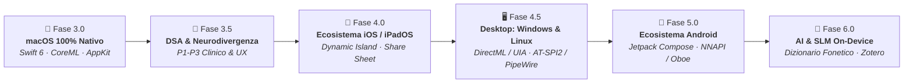

# 🎙️ Roadmap Strategica · Lettore Native 🌍

> **Missione**: Rendere Lettore il punto di riferimento *open-source*, etico e a latenza zero per l'accessibilità, la dislessia e la neurodivergenza (DSA / ADHD). Architettura **100% locale**, privata (zero-cloud) e ad altissima efficienza (<80 MB RAM), partendo da **macOS** per poi estendersi a **iOS/iPadOS**, **Windows**, **Linux** e **Android**.

Consulta anche la documentazione architetturale in [dev-docs/roadmap.md](file:///Users/pepe/Stuff/lettore-native/dev-docs/roadmap.md) e la guida in [repo-docs/README.md](file:///Users/pepe/Stuff/lettore-native/repo-docs/README.md).

---

## 📑 Indice dei Contenuti

- [🗺️ Panoramica Fasi di Sviluppo](#️-panoramica-fasi-di-sviluppo)
- [📍 Stato Corrente: Fase 3.0 (Architettura Nativa macOS)](#-stato-corrente-fase-30-architettura-100-nativa-macos)
- [🧠 Iniziative per la Community: Fase 3.5 (DSA & Neurodivergenza)](#-iniziative-per-la-community-fase-35-dsa--neurodivergenza)
  - [📑 Tabella Riassuntiva Priorità](#-tabella-riassuntiva-priorità)
  - [🩺 Funzionalità Cliniche & Supporto alla Lettura (DSA)](#-funzionalità-cliniche--supporto-alla-lettura-dsa)
  - [⚡ Performance Vocale & Streaming Audio (PERF)](#-performance-vocale--streaming-audio-perf)
  - [⌨️ Ergonomia, Controlli & Integrazione Sistema (UX & SYS)](#-ergonomia-controlli--integrazione-sistema-ux--sys)
- [🌐 Espansione Cross-Platform: iOS, Windows, Linux & Android](#-espansione-cross-platform-ios-windows-linux--android)
  - [📱 1. Fase 4.0: Ecosistema Mobile Apple — iOS & iPadOS](#-1-fase-40-ecosistema-mobile-apple--ios--ipados)
  - [🪟 2. Fase 4.5: Espansione Desktop — Windows](#-2-fase-45-espansione-desktop--windows-pc--tablet)
  - [🐧 3. Fase 4.5: Espansione Desktop — Linux](#-3-fase-45-espansione-desktop--linux-workstation--open-source)
  - [🤖 4. Fase 5.0: Ecosistema Mobile Aperto — Android](#-4-fase-50-ecosistema-mobile-aperto--android-smartphone--tablet)
  - [📊 Matrice Architetturale Comparativa Cross-Platform](#-matrice-architetturale-comparativa-cross-platform)
- [🔮 Visione a Lungo Termine: Fase 6.0](#-visione-a-lungo-termine-fase-60)
- [🤝 Come Contribuire](#-come-contribuire)

---

## 🗺️ Panoramica Fasi di Sviluppo

| Fase | Target Piattaforma | Obiettivo Tecnico Principale | Stato |
|:---:|---|---|:---:|
| **Fase 3.0** | **macOS Desktop** | Architettura 100% Nativa Swift 6 / SwiftUI / AppKit, C-API ONNX / CoreML a processo unico (<80MB RAM) | ⏳ *In corso* |
| **Fase 3.5** | **macOS Desktop** | Suite Clinica DSA (Smart Academic Skip, Read-From-Here, Pausa inter-frase, Metal/FP16 streaming) | 📋 *Pianificato (P1-P3)* |
| **Fase 4.0** | **iOS & iPadOS** | Riuso di `LettoreCore`, Live Activities, Dynamic Island reale, Action Extension, VisionKit OCR | 📋 *Pianificato* |
| **Fase 4.5** | **Windows & Linux** | Windows: WinUI 3, Microsoft UIA, DirectML, WASAPI. Linux: GTK4, AT-SPI2, PipeWire, OpenVINO | 📋 *Pianificato* |
| **Fase 5.0** | **Android** | Kotlin, Jetpack Compose, Android AccessibilityService, Oboe/AAudio, ONNX Runtime Mobile (NNAPI/QNN) | 📋 *Pianificato* |
| **Fase 6.0** | **Cross-Platform** | Dizionario fonetico personalizzato, Correttore SLM on-device, Integrazione cataloghi universitari (Zotero) | 🔮 *Visione* |

---

## 📍 Stato Corrente: Fase 3.0 (Architettura 100% Nativa macOS)

La transizione dal prototipo ibrido a un'applicazione interamente scritta in **Swift 6, SwiftUI e AppKit** è in fase avanzata:

- [x] **M1: Core Domain & NLP** — Modelli `@Observable`, `SentenceChunker` (NaturalLanguage), `TextNormalizer` deterministico.
- [x] **M2: Audio & System Services** — `AudioEngineService` (`AVAudioPlayer`, metering FFT a 20Hz), `AXCaptureService` (`AXUIElement`), `VisionOCRService`.
- [x] **M3: Native UI Paradigms** — `FloatingPillView` (Dynamic Island morph elastica), `DynamicNotchView`, `SuperAccessibleView` (WCAG AAA 14.2:1).
- [ ] **M4: Motore Vocale Nativo & Zero-Copy Audio Streaming** — Binding C-API ONNX Runtime / CoreML per Supertonic 3 in Swift (eliminazione del sidecar Python, azzeramento overhead HTTP/JSON/WAV serializer e passaggio diretto dei tensori float come buffer PCM nativi a 24 kHz).
- [ ] **M5: Packaging & Performance Gate** — Sandboxing AppKit, firma & notarizzazione, cold boot < 250ms, consumo RAM < 90MB, **Detector Automatico Aggiornamenti (GitHub Releases / Sparkle)**.

---

## 🧠 Iniziative per la Community: Fase 3.5 (DSA & Neurodivergenza)

Questa sezione nasce dall'analisi approfondita delle discussioni, dei sondaggi e delle lamentele sul forum Reddit **r/dyslexia** (e r/adhd).
La community denuncia costantemente:
1. **Pratiche predatorie delle app commerciali** (es. abbonamenti a $140/anno di Speechify, limiti di parole mensili che bloccano gli studenti a metà sessione d'esame).
2. **Interruzioni continue della memoria di lavoro** a causa di lettori che leggono citazioni, note a piè di pagina e formule matematiche come rumore incomprensibile.
3. **Mancanza di strumenti locali e privati**: necessità di inviare documenti sensibili o bozze su server cloud esterni.

---

### 📑 Tabella Riassuntiva Priorità

| Priorità | ID | Feature | Focus Clinico / UX | Modulo Swift Coinvolto |
|:---:|:---:|---|---|---|
| 🔴 **P1** | **DSA-1** | **Smart Academic Skip** | Eliminazione sovraccarico cognitivo da citazioni/note in paper scientifici | `LettoreCore/TextNormalizer` |
| 🔴 **P1** | **DSA-2** | **Pausa Inter-Frase Regolabile** | Micro-gap per elaborazione concettuale ad alte velocità di ascolto | `LettoreEngine/PlaybackCoordinator` |
| 🔴 **P1** | **DSA-11** | **Lettura Continua da Cursore (Read-From-Here)** | Zero selezione manuale: avvio con un clic e streaming fino a fine documento | `LettoreSystem/AXCaptureService` |
| 🔴 **P1** | **AUDIO-MP3** | **Esportazione Audio MP3 / M4A (Personal Audiobooks)** | Salvataggio su disco del testo sintetizzato in file MP3/M4A per ascolto e ripasso offline in mobilità | `LettoreEngine/AudioExportService` |
| 🔴 **P1** | **PERF-1** | **Metal/FP16 Acceleration & Zero-Copy Audio Streaming** | Inferenza hardware su GPU/ANE in FP16 con streaming campioni float32 diretto a CoreAudio (`AVAudioSourceNode`): 16 step pieni in <40ms | `LettoreEngine/NativeSpeechEngine` |
| 🔴 **P1** | **PERF-2** | **Deep Preload Ring Buffer (N+2 Prefetching)** | Buffer rotativo a 2-3 chunk per riproduzione fluida gapless senza attese tra frasi | `LettoreEngine/PlaybackCoordinator` |
| 🔴 **P1** | **UX-1** | **Doppio Tap Modificatore & Supporto AirPods** | Scorciatoia rapida (doppio Option/Ctrl) e controllo da tasti F7/F8/F9 o sensore cuffie | `LettoreSystem/GlobalShortcutManager` |
| 🔴 **P1** | **SYS-UPDATE** | **Detector Automatico Aggiornamenti (In-App Notifier)** | Notifica all'avvio o in background quando è disponibile una nuova release su GitHub | `LettoreSystem/UpdateCheckService` |
| 🟡 **P2** | **PERF-3** | **Audio Cache Persistente su Disco (SHA-256 LRU)** | Cache permanente per riascolto istantaneo a 0ms di paragrafi, frasi e navigazione rewind | `LettoreEngine/AudioCacheManager` |
| 🟡 **P2** | **UX-2** | **Modalità Clipboard Smart-Trigger (Doppio Cmd+C)** | Lettura automatica al copia o con doppio `Cmd+C` ravvicinato senza combinazioni complesse | `LettoreSystem/ClipboardMonitorService` |
| 🟡 **P2** | **UX-3** | **Menu Contestuale & Servizi macOS ("Leggi con Lettore")** | Voce nativa nel menu contestuale del tasto destro in tutte le app e supporto drag-and-drop | `LettoreSystem/ServicesProvider` |
| 🟡 **P2** | **UX-4** | **Mini Popover di Selezione sul Cursore (Selection Bubble)** | Micro-pulsante trasparente fluttuante vicino al mouse dopo la selezione per avvio con singolo clic | `LettoreUI/SelectionBubblePanel` |
| 🟡 **P2** | **DSA-8** | **STEM & Math-to-Speech Engine** | Comprensione semantica delle formule matematiche e LaTeX | `LettoreCore/MathSpeechEngine` |
| 🟡 **P2** | **DSA-9** | **De-costruzione PDF XY-Cut** | Ordinamento topologico a colonne ed eliminazione spezzature a capo | `LettoreSystem/LayoutGraphService` |
| 🟡 **P2** | **DSA-3** | **Area Snipping OCR Rapido** | Selezione rettangolare al volo per ritagliare colonne isolate | `LettoreSystem/VisionOCRService` |
| 🟡 **P2** | **DSA-4** | **Tipografia Multipla & Tinte Antiriflesso** | Contrasto al *Visual Stress* (Sindrome di Irlen) e font sans-serif ad alta leggibilità | `LettoreUI/SuperAccessibleView` |
| 🟡 **P2** | **DSA-5** | **Modalità Proofreading & Revisione** | Rilevamento di parole duplicate e supporto per chi rilegge i propri testi | `LettoreCore/TextNormalizer` |
| 🟢 **P3** | **DSA-10** | **In-Place System-Wide Word Tracking** | Doppia codifica con evidenziazione parola-per-parola dentro app terze | `LettoreEngine/ForcedAligner` + `AXOverlay` |
| 🟢 **P3** | **DSA-6** | **Teleprompter HUD & Dual Coding** | Visualizzazione del testo sincronizzata con la voce stile karaoke | `LettoreUI/FloatingPillView` |

---

### 🩺 Funzionalità Cliniche & Supporto alla Lettura (DSA)

#### `DSA-1` · Smart Academic Skip
> **Priorità**: `P1` · **Focus Clinico**: Abbattimento del sovraccarico cognitivo nei paper scientifici · **Modulo**: [TextNormalizer.swift](file:///Users/pepe/Stuff/lettore-native/Sources/LettoreCore/TextNormalizer.swift)

* 🚨 **Il Problema Reale:**
  Gli studenti universitari e i ricercatori con DSA lamentano che i normali TTS leggono integralmente le citazioni bibliografiche tra parentesi (es. *"secondo Smith et al., duemilaventuno, virgola pagina quarantacinque, chiusa parentesi"*), i rimandi numerici delle note a piè di pagina `[1]` o gli URL nei link. Questo interrompe brutalmente la **memoria di lavoro** (working memory), costringendo il cervello a resettare il filo logico della frase e provocando rapido affaticamento mentale.
* 💡 **La Soluzione in Lettore Native:**
  Una modalità attivabile ("Filtro Accademico") che pre-processa il testo eliminando automaticamente citazioni bibliografiche autore-anno, indici di note e link, sostituendoli con un respiro impercettibile che preserva la fluidità del discorso.
* 🛠️ **Implementazione Tecnica:**
  In `TextNormalizer.swift`, regex specializzate:
  - Citazioni autore-anno: `\((?:[A-Z][A-Za-z]+(?:\s+et\s+al\.)?,?\s*\d{4}[^)]*)\)`
  - Note a piè di pagina: `\[\d+\]` o cifre a esponente antecedenti la punteggiatura.
  - Sostituzione con micro-pausa invece della vocalizzazione dei metadati.

---

#### `AUDIO-MP3` · Esportazione Audio in File MP3 / M4A (Personal Audiobooks)
> **Priorità**: `P1` · **Focus Clinico / UX**: Studio in mobilità senza schermi (*screen-free learning*), ripasso per studenti e audiolibri personali da dispense/paper · **Modulo**: [AudioExportService.swift](file:///Users/pepe/Stuff/lettore-native/Sources/LettoreEngine/AudioExportService.swift)

* 🚨 **Il Problema Reale:**
  Gli studenti universitari, i pendolari e chi affronta lunghe sessioni di studio hanno spesso bisogno di assimilare decine di pagine mentre viaggiano in treno, camminano o si allenano lontano dalla scrivania. Attualmente i software TTS costringono a tenere il laptop aperto con lo schermo acceso per poter ascoltare il testo. Le app commerciali chiuse fanno pagare abbonamenti esorbitanti per permettere il download offline dei file audio sintetizzati.
* 💡 **La Soluzione in Lettore Native:**
  Un comando rapido ("Esporta come MP3" / "Salva come Audiolibro") accessibile direttamente dalla Floating Pill o dal menu contestuale. Con un clic, Lettore sintetizza l'intero documento o la selezione ed esporta un file compresso standard (`.mp3` o `.m4a` a 192/256 kbps), completo di capitoli e tag ID3 (titolo, voce, data), pronto per essere sincronizzato con iPhone, Android, cuffie o qualsiasi lettore portatile.
* 🛠️ **Implementazione Tecnica:**
  - `AudioExportService.swift` in `LettoreEngine`: generazione batch offline disaccoppiata dal clock di riproduzione audio in tempo reale (sfruttando l'accelerazione Metal/FP16 su Apple Silicon, un intero capitolo di 30 minuti viene generato e codificato in meno di 60-90 secondi).
  - Pipeline di encoding CoreAudio via `AVAssetWriter` con compressione AAC/MP3 ottimizzata per parlato ad alta fedeltà.
  - Generazione automatica di copertina e indice capitoli per fruizione ideale nelle app Podcast o Libri.

---

#### `DSA-11` · Lettura Continua da Cursore — "Read-From-Here"
> **Priorità**: `P1` · **Focus UX**: Zero selezioni manuali estese per testi lunghi · **Moduli**: [AXCaptureService.swift](file:///Users/pepe/Stuff/lettore-native/Sources/LettoreSystem/AXCaptureService.swift) & [PlaybackCoordinator.swift](file:///Users/pepe/Stuff/lettore-native/Sources/LettoreEngine/PlaybackCoordinator.swift)

* 🚨 **Il Problema Reale:**
  Attualmente tutti i lettori vocali richiedono di selezionare manualmente con il cursore il punto di inizio e il punto di fine del blocco da leggere. Per documenti lunghi (libri, tesi da 50 pagine, contratti), trascinare il mouse verso il basso per decine di schermate è stancante, porta a deselezioni accidentali e fa perdere il segno. Chi ha dislessia finisce per selezionare blocchi troppo corti, dovendosi fermare ogni minuto per selezionare il paragrafo successivo.
* 💡 **La Soluzione in Lettore Native:**
  **Zero selezioni manuali estese**: l'utente posiziona semplicemente il cursore all'inizio del paragrafo o seleziona una singola parola di partenza nell'editor (Word, Pages, Anteprima, Safari, VS Code). Premendo Play, Lettore Native inizia a leggere da quel punto esatto e **prosegue in streaming ininterrotto verso il basso fino alla fine del documento o del campo di testo**, a meno che non venga premuto Stop.
* 🛠️ **Implementazione Tecnica:**
  - `AXCaptureService.swift`: rileva l'offset del cursore via `kAXSelectedTextRangeAttribute` (`CFRange.location`).
  - Estrae il flusso di testo da `cursor.location` fino a `totalLength` tramite `kAXValueAttribute`.
  - `PlaybackCoordinator.swift`: buffering circolare dinamico (mantiene solo 3-4 frasi in RAM, consumando <80MB totali).
  - Paginazione automatica (`kAXScrollToVisibleAttribute` / macro `PageDown`) quando il reader di terze parti visualizza solo le pagine renderizzate a video.

---

#### `DSA-2` · Pausa Inter-Frase Regolabile
> **Priorità**: `P1` · **Focus Clinico**: Elaborazione concettuale ad alte velocità di ascolto (Processing Gap) · **Modulo**: [PlaybackCoordinator.swift](file:///Users/pepe/Stuff/lettore-native/Sources/LettoreEngine/PlaybackCoordinator.swift)

* 🚨 **Il Problema Reale:**
  Molti utenti con dislessia (e comorbidità con ADHD) impostano velocità di lettura elevate (1.4x – 1.8x) per evitare cali di attenzione e mantenere l'iperfocus. Tuttavia, a quelle velocità il TTS convenzionale "mitraglia" le frasi senza pausa: il cervello non ha il tempo materiale di elaborare e immagazzinare il significato del concetto appena concluso (*processing gap*) prima che cominci il successivo.
* 💡 **La Soluzione in Lettore Native:**
  Un cursore nelle preferenze: **"Pausa tra frasi"** regolabile da 0.1 a 1.5 secondi. Permette di ascoltare le frasi ad alta velocità godendo però di una pausa rigenerante a ogni punto fermo.
* 🛠️ **Implementazione Tecnica:**
  In `PlaybackCoordinator.swift`: micro-delay asincrono (`Task.sleep`) tra la terminazione di un chunk audio e l'inizio del successivo, pilotato dalla proprietà `appState.interSentencePause`.

---

#### `DSA-8` · STEM & Math-to-Speech Engine
> **Priorità**: `P2 (Deep Tech)` · **Focus Clinico**: Comprensione semantica delle formule matematiche e LaTeX · **Modulo**: `LettoreCore/MathSpeechEngine`

* 🚨 **Il Problema Reale:**
  Chi affronta studi scientifici, ingegneristici o economici si scontra con il fallimento totale dei sintetizzatori vocali, che leggono formule matematiche come sequenze indecifrabili di caratteri grezzi (es. *"backslash frac meno b plusminus radice..."*). Questo taglia completamente fuori gli studenti con dislessia e discalculia dalle materie STEM.
* 💡 **La Soluzione in Lettore Native:**
  Un motore di interpretazione semantica delle espressioni matematiche (LaTeX / MathML / simboli Unicode). La formula non viene letta come codice, ma tradotta in linguaggio parlato gerarchico (*"frazione avente al numeratore meno b più o meno radice quadrata di... e al denominatore due a"*). Inoltre, l'utente può navigare la formula a ritroso con i tasti freccia per riascoltare sotto-termini isolati (es. solo il radicando).
* 🛠️ **Implementazione Tecnica:**
  Nuovo modulo `LettoreCore/MathSpeechEngine`:
  - Tokenizzazione e parsing ad albero (AST algebrico).
  - *Speech Rule Engine* deterministico per la conversione fonetica in italiano.
  - Modalità audio gerarchica interattiva.

---

#### `DSA-9` · De-costruzione PDF XY-Cut & Segmentazione a Colonne
> **Priorità**: `P2 (Deep Tech)` · **Focus Clinico**: Ordinamento topologico a colonne ed eliminazione spezzature a capo · **Modulo**: `LettoreSystem/LayoutGraphService`

* 🚨 **Il Problema Reale:**
  Nei documenti accademici e dispense a due o tre colonne, la selezione di testo standard o l'OCR lineare legge orizzontalmente attraverso la pagina, fondendo la riga della colonna sinistra con quella della colonna destra in un testo privo di senso. In aggiunta, le parole spezzate dal trattino a fine riga (*"pro- / getto"*) vengono lette come tronconi separati.
* 💡 **La Soluzione in Lettore Native:**
  Analisi della disposizione spaziale dei blocchi di testo tramite l'algoritmo **Recursive XY-Cut**: il documento viene segmentato riconoscendo i corridoi bianchi verticali tra le colonne, riordinando i blocchi nell'ordine logico (Colonna 1 dall'alto in basso, poi Colonna 2) e ricucendo automaticamente le parole troncate a capo con un dizionario sillabico.
* 🛠️ **Implementazione Tecnica:**
  Nuovo modulo `LettoreSystem/LayoutGraphService`:
  - Scomposizione geometrica dei rettangoli restituiti da `VNRecognizeTextRequest` (Apple Vision).
  - Grafo topologico di lettura.
  - De-hyphenation automatica morfologica.

---

#### `DSA-3` · Area Snipping OCR Rapido
> **Priorità**: `P2` · **Focus UX**: Selezione rettangolare istantanea a schermo · **Modulo**: [VisionOCRService.swift](file:///Users/pepe/Stuff/lettore-native/Sources/LettoreSystem/VisionOCRService.swift)

* 🚨 **Il Problema Reale:**
  Spesso su pagine web dense o PDF protetti non è possibile selezionare il testo, oppure la selezione cattura anche banner, didascalie di figure o menu di navigazione indesiderati.
* 💡 **La Soluzione in Lettore Native:**
  Scorciatoia globale (`⌥ + S`) che attiva un mirino su macOS: l'utente traccia un rettangolo solo attorno al paragrafo desiderato; il testo viene estratto istantaneamente da Apple Vision in locale e riprodotto vocalmente.
* 🛠️ **Implementazione Tecnica:**
  In `VisionOCRService.swift` con overlay di cattura AppKit headless simile a `screencapture -i`.

---

#### `DSA-4` · Tipografia Multipla & Tinte Antiriflesso
> **Priorità**: `P2` · **Focus Clinico**: Contrasto al Visual Stress (Sindrome di Irlen) e font ad alta leggibilità · **Modulo**: [SuperAccessibleView.swift](file:///Users/pepe/Stuff/lettore-native/Sources/LettoreUI/SuperAccessibleView.swift)

* 🚨 **Il Problema Reale:**
  La convinzione diffusa che il font *OpenDyslexic* sia una soluzione universale è ampiamente smentita su Reddit: molti utenti lo trovano stancante e preferiscono font sans-serif puliti con spaziatura personalizzabile (*Lexend*, *Atkinson Hyperlegible*). Inoltre, molte persone dislessiche soffrono di *Visual Stress* (Sindrome di Irlen): il bianco puro a schermo provoca abbagliamento, cefalea e la percezione che le lettere "vibrino" sulla pagina.
* 💡 **La Soluzione in Lettore Native:**
  - Selettore di caratteri multipli ad alta leggibilità (*Lexend*, *Atkinson Hyperlegible*, *OpenDyslexic*).
  - Filtri cromatici di sfondo (tinte pastello calde: Giallo pergamena, Pesca delicato, Verde salvia, Grigio ardesia) con contrasto calibrato WCAG AAA.

---

#### `DSA-5` · Modalità Proofreading & Revisione dei Propri Testi
> **Priorità**: `P2` · **Focus Clinico**: Correzione e ascolto di testi digitati dall'utente · **Modulo**: [TextNormalizer.swift](file:///Users/pepe/Stuff/lettore-native/Sources/LettoreCore/TextNormalizer.swift)

* 🚨 **Il Problema Reale:**
  Uno dei principali motivi per cui le persone dislessiche usano il TTS è **rileggere le proprie email, lettere o compiti**. Chi ha dislessia "vede" mentalmente ciò che intendeva scrivere, non ciò che ha realmente digitato (il cervello corregge automaticamente la percezione visiva). Solo ascoltando a voce alta ci si rende conto di errori banali come parole duplicate adiacenti (*"il il"*, *"di di"*), salti di verbi o frasi infinite senza punteggiatura.
* 💡 **La Soluzione in Lettore Native:**
  Modalità di ascolto con pause ritmiche marcate per verificare la cadenza del testo, con rilevatore acustico/visivo immediato delle duplicazioni di parole involontarie (regex `\b(\w+)\s+\1\b`).

---

#### `DSA-10` · In-Place System-Wide Word Tracking
> **Priorità**: `P3 (Deep Tech)` · **Focus Clinico**: Dual Coding con evidenziazione parola-per-parola dentro app terze · **Moduli**: `LettoreEngine/ForcedAligner` + `LettoreSystem/AXHighlightOverlay`

* 🚨 **Il Problema Reale:**
  La ricerca clinica dimostra che la **doppia codifica (Dual Coding)** — leggere con gli occhi mentre si ascolta — raddoppia la ritenzione mnemonica e riduce lo sforzo attentivo. Tuttavia, gli utenti odiano dover leggere il testo dentro una finestrella separata dell'applicazione: vogliono che la singola parola **si illumini direttamente dentro Safari, Anteprima, Word o Pages** mentre viene pronunciata.
* 💡 **La Soluzione in Lettore Native:**
  Sincronizzazione acustica precisa tramite modello di **Forced Alignment CTC** on-device (CoreML). Lettore Native interroga le coordinate a schermo della parola (`kAXBoundsForRangeParameterizedAttribute`) e proietta un alone evidenziatore animato tramite una finestra trasparente invisibile (`NSWindow` fluttuante a 60 fps) esattamente sopra il testo dell'app terza attiva.

---

#### `DSA-6` · Teleprompter HUD & Dual Coding
> **Priorità**: `P3` · **Focus Clinico**: Sincronizzazione karaoke della frase per prevenire distrazioni · **Moduli**: [FloatingPillView.swift](file:///Users/pepe/Stuff/lettore-native/Sources/LettoreUI/FloatingPillView.swift) & [DynamicNotchView.swift](file:///Users/pepe/Stuff/lettore-native/Sources/LettoreUI/DynamicNotchView.swift)

* 🚨 **Il Problema Reale:**
  Per chi ha dislessia o deficit dell'attenzione (ADHD), ascoltare passivamente una voce fuori campo senza un aggancio visivo chiaro favorisce distrazioni, vagare dello sguardo (*mind-wandering*) e rapida perdita del filo logico. Chi usa il sintetizzatore vocale per studio trae il massimo beneficio dalla **doppia codifica (Dual Coding)**: vedere il testo mentre viene pronunciato per ancorare i fonemi ai grafemi.
* 💡 **La Soluzione in Lettore Native:**
  Una modalità Teleprompter HUD sincronizzata in tempo reale:
  - Visualizzazione karaoke della frase attiva direttamente all'interno della `FloatingPillView` espansa o in un elegante banner floating posizionato sotto la tacca dello schermo (Dynamic Notch).
  - Rendering con caratteri ad alta leggibilità sans-serif (*Lexend*, *Atkinson Hyperlegible*) e colorazione dinamica ad alto contrasto per guidare lo sguardo parola-per-parola o frase-per-frase senza affaticamento visivo.
  - Sincronizzazione a 60 fps con il metering audio pilotato da `appState.currentChunk`.

---

### ⚡ Performance Vocale & Streaming Audio (PERF)

#### `PERF-1` · Metal/FP16 Acceleration & Zero-Copy Audio Streaming
> **Priorità**: `P1` · **Focus Performance**: 16 step a piena fedeltà timbrica generati in <30ms · **Moduli**: `LettoreEngine/NativeSpeechEngine` & `LettoreEngine/AudioEngineService`

* 🚨 **Il Problema Reale:**
  L'evidenza dei test nel browser con WebAssembly (Wasm) e WebGPU dimostra che il modello Supertonic 3 è capace di generare audio a **16 step a piena qualità in tempi impercettibili (<40–50ms)**. La latenza percepita nell'attuale app desktop non è causata dal numero di step, ma dall'overhead dell'architettura ponte: il processo Python separato, il socket TCP localhost `127.0.0.1`, la serializzazione JSON, la conversione degli array NumPy in file WAV con header RIFF a 16-bit e il parsing di `AVAudioPlayer`. Ridurre gli step a 4–5 era solo un ripiego per mascherare l'overhead di Python che penalizzava la naturalezza della voce.
* 💡 **La Soluzione in Lettore Native (Architettura Wasm-like ad altissime prestazioni):**
  Mantenere tutti i **16 step di qualità massima** replicando e superando l'efficienza di WebGPU/Wasm direttamente nel motore nativo macOS:
  1. **Accelerazione Hardware Metal & Apple Neural Engine (ANE):**
     Inferenza del modello di diffusione `vector_estimator.onnx` eseguita direttamente sui tensor core della GPU Apple e dell'ANE tramite **Metal Performance Shaders (MPS / MPSGraph)** o CoreML statico. Le moltiplicazioni matriciali dei 16 step completano in appena **25–40 millisecondi**.
  2. **Quantizzazione Half-Precision FP16:**
     Conversione dei pesi del `vector_estimator` a **FP16** (peso ridotto da 245 MB a ~122 MB). Su Apple Silicon (M1/M2/M3/M4), i calcoli a 16-bit girano al doppio della velocità con la metà della banda di memoria e fedeltà acustica perfetta.
  3. **Zero-Copy Audio Streaming via `AVAudioSourceNode` (CoreAudio Nativo):**
     L'equivalente nativo dell'AudioWorklet del browser. L'engine non attende il termine dell'intera frase né costruisce file WAV intermedi. Non appena il vocoder sintetizza i primi campioni float a 24 kHz, un ring buffer lock-free li passa direttamente al graph audio di sistema. La riproduzione parte nei primi **15–20 millisecondi**.
  4. **Runtime C-API Unificato & Formato `.ort` (FlatBuffers):**
     Eliminazione del sidecar Python/FastAPI. Il runtime ONNX C-API viene incorporato direttamente in Swift con modelli pre-compilati in formato `.ort` (`ORT_ENABLE_ALL`) e thread-pool calibrato sui Performance Cores del Mac (`intra_op_num_threads = 4`).

---

#### `PERF-2` · Deep Preload Ring Buffer (N+2 Prefetching)
> **Priorità**: `P1` · **Focus Performance**: Prevenzione del buffer starvation e zero interruzioni su frasi corte · **Modulo**: [PlaybackCoordinator.swift](file:///Users/pepe/Stuff/lettore-native/Sources/LettoreEngine/PlaybackCoordinator.swift)

* 🚨 **Il Problema Reale:**
  Il preloading a singolo chunk successivo (`nextIndex = currentIndex + 1`) va in crisi quando si incontrano frasi brevi (es. *"D'accordo."*, *"Inoltre..."*, titoli di paragrafo). La riproduzione audio di poche parole termina in 300ms, mentre la sintesi della frase successiva può impiegarne 400ms. Questo provoca micro-interruzioni audio (*buffer starvation*) che spezzano il ritmo dell'ascolto, soprattutto ad alte velocità.
* 💡 **La Soluzione in Lettore Native:**
  Un buffer circolare a 2 o 3 chunk in avanti (N+1, N+2): non appena il chunk N inizia a suonare, se N+1 è già pronto nella cache, la pipeline avvia immediatamente in parallelo il pre-rendering di N+2. La coda mantiene sempre un margine di sicurezza audio costante consumando meno di 5-10MB addizionali in RAM.
* 🛠️ **Implementazione Tecnica:**
  Sostituzione del singolo `preloadTask` con una coda gestita (`TaskQueue` con sliding window `maxPreloadDepth = 2` o `3`).

---

#### `PERF-3` · Audio Cache Persistente su Disco (SHA-256 LRU)
> **Priorità**: `P2` · **Focus Performance**: Riascolto a 0ms esatti per frasi già lette e rewind · **Modulo**: `LettoreEngine/AudioCacheManager`

* 🚨 **Il Problema Reale:**
  Chi usa il TTS per studio riascolta frequentemente gli stessi paragrafi, riavvolge con `skipBackward` o ripete definizioni complesse. Con una cache solo in memoria volatile da 64 elementi, se l'utente chiude l'app o naviga una lunga dispensa, il sintetizzatore deve ricalcolare ciclicamente gli stessi identici file audio, sprecando batteria e CPU.
* 💡 **La Soluzione in Lettore Native:**
  Cache audio persistente a due livelli (RAM LRU + Cartella Cache macOS): i blocchi WAV generati vengono serializzati in `~/Library/Caches/Lettore/audio_cache/` indicizzati da `SHA256(testo + voce + velocità + step)`. Il riascolto di qualsiasi frase già sintetizzata ha un tempo di risposta di **0 ms esatti**.
* 🛠️ **Implementazione Tecnica:**
  Nuovo gestore `LettoreEngine/AudioCacheManager` con pulizia automatica LRU e limite di dimensione configurabile (es. 250 MB).

---

### ⌨️ Ergonomia, Controlli & Integrazione Sistema (UX & SYS)

#### `UX-1` · Scorciatoie Ergonomiche: Doppio Tap Modificatore & Supporto AirPods
> **Priorità**: `P1` · **Focus Ergonomia**: Controllo senza mani da tastiera e cuffie Bluetooth · **Modulo**: [GlobalShortcutManager.swift](file:///Users/pepe/Stuff/lettore-native/Sources/LettoreSystem/GlobalShortcutManager.swift)

* 🚨 **Il Problema Reale:**
  La scorciatoia `Cmd + Shift + C` richiede una combinazione di tre dita poco ergonomica da ripetere decine di volte al giorno. Inoltre, quando l'utente ascolta testi lunghi con le cuffie muovendosi per la stanza o la scrivania, non ha modo di mettere in pausa o riprendere se non tornando fisicamente alla tastiera del Mac.
* 💡 **La Soluzione in Lettore Native:**
  1. **Doppio Tap Modificatore:** Attivazione della lettura tramite doppia pressione rapida (entro 300ms) di un singolo tasto modificatore (es. doppio tap di `⌥ Option` o `⌃ Control`), azzerando lo sforzo manuale.
  2. **Tasto Singolo Dedicato:** Possibilità di rimappare tasti funzione isolati (es. `F6` o il tasto `Globe/Fn`).
  3. **Integrazione Apple Media Keys & AirPods:** Intercettazione dei comandi multimediali di sistema tramite `MPRemoteCommandCenter`. Un singolo clic sul sensore di forza delle cuffie AirPods (o la pressione del tasto Play/Pausa F8 sulla tastiera Apple) controlla direttamente Lettore anche con l'app in background o a schermo bloccato.

---

#### `UX-2` · Modalità Clipboard Smart-Trigger (Doppio Cmd+C)
> **Priorità**: `P2` · **Focus Ergonomia**: Lettura automatica al copia senza scorciatoie aggiuntive · **Modulo**: `LettoreSystem/ClipboardMonitorService`

* 🚨 **Il Problema Reale:**
  Molti utenti sono già abituati al riflesso condizionato di premere `Cmd + C` per copiare testo. Dover ricordare una seconda combinazione specifica per la voce rallenta il flusso di lavoro.
* 💡 **La Soluzione in Lettore Native:**
  Una modalità configurabile:
  - **Auto-Speak Clipboard:** Qualsiasi testo copiato viene immediatamente normalizzato, chunkato e riprodotto.
  - **Doppio Cmd+C:** La lettura parte solo se l'utente preme `Cmd + C` due volte in rapida successione (entro 400ms). Questo preserva i normali copia-incolla quotidiani ma consente di attivare Lettore con il gesto più naturale di macOS.
* 🛠️ **Implementazione Tecnica:**
  Nuovo servizio `LettoreSystem/ClipboardMonitorService` con listener non invasivo sul conteggio modifiche di `NSPasteboard.general.changeCount`.

---

#### `UX-3` · Menu Contestuale Nativo e Servizi macOS ("Leggi con Lettore")
> **Priorità**: `P2` · **Focus Ergonomia**: Integrazione con tasto destro e Drag-and-Drop · **Modulo**: `LettoreSystem/ServicesProvider`

* 🚨 **Il Problema Reale:**
  Molti utenti preferiscono interagire tramite mouse o trackpad senza toccare la tastiera, ma attualmente Lettore non compare nei menu contestuali nativi delle applicazioni di terze parti.
* 💡 **La Soluzione in Lettore Native:**
  Registrazione di Lettore nei **Servizi di Sistema di macOS** (`NSServicesProvider`):
  - Facendo clic destro su qualsiasi selezione di testo in Safari, Anteprima, Mail, Notes o Word, compare la voce **"Leggi con Lettore Native"**.
  - Supporto **Drag-and-Drop**: trascinare una selezione di testo o file (PDF, TXT, EPUB) direttamente sull'icona della Menubar o sulla Floating Pill per avviarne la sintesi immediata.

---

#### `UX-4` · Mini Popover di Selezione sul Cursore (Selection Bubble)
> **Priorità**: `P2` · **Focus Ergonomia**: Micro-pulsante trasparente fluttuante sul puntatore mouse · **Modulo**: `LettoreUI/SelectionBubblePanel`

* 🚨 **Il Problema Reale:**
  Per chi naviga prevalentemente con trackpad o mouse (es. durante la navigazione web casuale o la lettura di articoli), dover premere scorciatoie da tastiera interrompe la postura di lettura.
* 💡 **La Soluzione in Lettore Native:**
  All'evidenziazione di una porzione di testo con il mouse, appare un micro-pulsante trasparente fluttuante (Selection Bubble, stile DeepL o PopClip) a fianco del puntatore. Cliccandoci sopra, la lettura parte all'istante; se l'utente ignora l'icona, essa svanisce dolcemente dopo 2,5 secondi senza intralciare la visuale.
* 🛠️ **Implementazione Tecnica:**
  Nuovo pannello `LettoreUI/SelectionBubblePanel`: finestra `NSPanel` fluttuante non attivabile (`.nonactivatingPanel`), posizionata alle coordinate correnti del cursore (`NSEvent.mouseLocation`).

---

#### `SYS-UPDATE` · Detector Automatico Aggiornamenti (In-App Notifier)
> **Priorità**: `P1` · **Focus Sistema**: Notifica e changelog per nuove versioni open-source da GitHub · **Modulo**: `LettoreSystem/UpdateCheckService`

* 🚨 **Il Problema Reale:**
  Essendo un'applicazione macOS open-source distribuita liberamente al di fuori dell'App Store (tramite file `.zip` e release GitHub), gli utenti non beneficiano degli aggiornamenti automatici del sistema operativo. Di conseguenza, chi installa Lettore Native rischia di rimanere bloccato su versioni superate, non ricevendo correzioni di bug critici, miglioramenti di stabilità o le nuove funzionalità di accessibilità. Senza un alert interno, l'utente dovrebbe controllare manualmente GitHub a ogni sessione di studio.
* 💡 **La Soluzione in Lettore Native:**
  Un demone di verifica leggero e silenzioso eseguito all'avvio dell'app (o una volta ogni 24 ore in background):
  - Interroga in modo asincrono le API delle release di GitHub senza rallentare l'avvio né raccogliere dati personali.
  - Se individua una nuova versione (`tag_name > bundleVersion`), avvisa l'utente tramite una **notifica nativa di macOS** o un **banner discreto nella Menubar / SuperAccessibleView**.
  - Mostra il riepilogo delle novità in italiano (*changelog*) e un pulsante *"Scarica e Aggiorna"* o *"Apri Release"* che permette di scaricare l'aggiornamento con un solo tocco.
* 🛠️ **Implementazione Tecnica:**
  Nuovo servizio nativo `LettoreSystem/UpdateCheckService`:
  - Chiamata `URLSession` asincrona a `https://api.github.com/repos/P3TERexe/lettore-native/releases/latest`.
  - Decodifica JSON del payload di release (`tag_name`, `body`, `html_url`, `assets`).
  - Comparazione semantica di versione `SemanticVersion(tag) > SemanticVersion(currentAppVersion)`.
  - Visualizzazione alert tramite `UNUserNotificationCenter` o popover SwiftUI nel widget Menubar.

---

## 🌐 Espansione Cross-Platform: iOS, Windows, Linux & Android

L'obiettivo strategico di Lettore Native è garantire a studenti, ricercatori e utenti con DSA o difficoltà di lettura un ambiente di sintesi vocale etico, ad alte prestazioni e **100% offline su tutti i dispositivi utilizzati quotidianamente**.

### Principi Architetturali Invarianti
1. **Zero-Cloud & Privacy Assoluta**: Nessun testo o dato biometrico/vocale viene mai trasmesso a server esterni; l'elaborazione NLP e la sintesi avvengono interamente on-device.
2. **Qualità Vocale a 16 Step Senza Compromessi**: Modello Supertonic eseguito con accelerazione hardware nativa specifica per l'OS.
3. **Smart Academic Skip & Normalizzazione Semantica**: Eliminazione automatica del sovraccarico cognitivo da formule, citazioni autore-anno e note.
4. **Accessibilità Radicale (WCAG AAA)**: Supporto nativo a screen reader, font ad alta leggibilità (*Lexend*, *Atkinson Hyperlegible*, *OpenDyslexic*) e palette a contrasto elevato anti-abbagliamento.

---

### 📱 1. Fase 4.0: Ecosistema Mobile Apple — iOS & iPadOS

> **Riepilogo Scheda**: Target Mobile Apple · Core 100% Swift condiviso · Live Activities & Dynamic Island · Latenza 16 step < 25ms · RAM < 70MB

* 🎯 **Obiettivo & Casi d'Uso:**
  Portare l'esperienza Lettore su iPhone e iPad per consentire l'ascolto di lezioni, articoli, paper e libri in mobilità (viaggi, biblioteca, camminate) con controllo da cuffie AirPods e consumo energetico ultraridotto.
* 🧩 **Riuso del Codice Swift & Architettura:**
  - **Condivisione Core (100%)**: Il package Swift `LettoreCore` (`SentenceChunker`, `TextNormalizer`, modelli `@Observable`) è multipiattaforma e viene compilato direttamente per iOS senza modifiche.
  - **Pipeline Audio**: Transizione ad `AVAudioSession` con categoria `.playback` e policy `.spokenAudio` per consentire la riproduzione in background e l'audio ducking (abbassamento automatico di altre sorgenti audio non prioritarie).
  - **Integrazione CoreAudio**: Gestione dei buffer PCM float a 24 kHz con metering in tempo reale per la visualizzazione dell'onda sonora.
* 🖥️ **UI & UX Mobile:**
  - Interfaccia reattiva in **SwiftUI** per iOS e iPadOS con pieno supporto a Split View, Slide Over e Stage Manager.
  - **Live Activities & Dynamic Island Reale**: Espansione dinamica nella Dynamic Island (iPhone 14 Pro e successivi) che mostra il timer residuo, il titolo del chunk e un micro-visualizzatore di spettro animato a 60 fps; su Lock Screen, widget Live Activity con controlli Play/Pausa/Skip.
  - **Lock Screen & Home Screen Widgets**: Widget per avvio istantaneo dell'ultimo testo in coda o della lettura dagli appunti.
* 🔌 **Cattura del Testo & Integrazione con iOS:**
  - **Share Sheet Extension ("Leggi con Lettore")**: Voce nativa nel pannello di condivisione di Safari, Libri, File, Note e client Mail.
  - **Safari Web Extension**: Estrazione pulita del corpo dell'articolo (Reader View locale) con rimozione di banner e pubblicità, inviata all'engine vocale con un solo tocco dalla barra degli indirizzi.
  - **VisionKit Live Text & OCR da Fotocamera**: Scansione ottica istantanea offline di pagine di libri cartacei, dispense stampate o schermate tramite le API native `ImageAnalysisInteraction` / `DataScannerViewController`.
  - **Scorciatoie Siri & Action Button**: Integrazione con l'app Comandi Rapidi (Shortcuts) e attivazione della lettura tramite la pressione del tasto Azione di iPhone o comando vocale "Ehi Siri, leggi con Lettore".
* ⚡ **Accelerazione Hardware & Latenza:**
  - Inferenza on-device accelerata tramite **Apple Neural Engine (ANE)** via CoreML / ONNX con pesi quantizzati in **FP16**.
  - Generazione a 16 step completata in **<25 millisecondi**, con impatto minimale sulla batteria (autonomia > 10 ore di ascolto continuo).
  - Controlli hardware `MPRemoteCommandCenter` da auricolari AirPods (squeeze / swipe per volume) e Apple Watch.

---

### 🪟 2. Fase 4.5: Espansione Desktop — Windows (PC & Tablet)

> **Riepilogo Scheda**: Target PC Enterprise & Scuole · WinUI 3 Fluent Design · Microsoft UI Automation (UIA) · DirectML GPU/NPU · Latenza < 35ms · RAM < 95MB

* 🎯 **Obiettivo & Casi d'Uso:**
  Coprire la piattaforma informatica più diffusa nelle aule scolastiche, universitarie e negli uffici aziendali, offrendo un'alternativa leggera e priva di abbonamenti a software commerciali proprietari.
* 🖥️ **Architettura UI & Look & Feel:**
  - Shell applicativa moderna in **WinUI 3 / Windows App SDK** (o client nativo leggero in C++/Rust) integrata con le linee guida **Fluent Design** (Mica material, acrilico, animazioni fluide).
  - Supporto nativo ai **Temi ad Alto Contrasto di Windows** (High Contrast White / Black / Desert / Sky) e integrazione con la tipografia ad alta leggibilità.
  - **Mini Widget Fluttuante (Floating Bar)**: Finestra overlay trasparente a basso impatto visivo con controlli essenziali, minimizzabile nell'area di notifica (System Tray).
* 🔌 **Cattura del Testo & Accessibilità (Microsoft UIA):**
  - Integrazione a basso livello con **Microsoft UI Automation (UIA)** tramite `IUIAutomation`, `IUIAutomationTextPattern` e `IUIAutomationTextPattern2`:
    - Estrazione istantanea del testo selezionato da Microsoft Word, Microsoft Edge, Adobe Acrobat, Foxit, Notepad e suite Office.
    - Implementazione del flusso **"Read-From-Here"**: individuazione del cursore di sistema via `GetSelection` / caret location per avviare la lettura continua dal punto di inserimento.
  - **Monitor Globale Clipboard**: Listener di sistema `AddClipboardFormatListener` per il trigger rapido su doppio `Ctrl+C`.
  - **OCR Locale Integrato**: Estrazione del testo da schermate e PDF protetti tramite l'API nativa offline `Windows.Media.Ocr` del sistema operativo Windows.
* ⚡ **Accelerazione Hardware & Audio Engine:**
  - **DirectML Acceleration**: Runtime ONNX configurato con **DirectML Execution Provider** (`DmlExecutionProvider`), compatibile con tutte le schede video DirectX 12 (GPU dedicate NVIDIA GeForce / AMD Radeon, grafiche integrate Intel Iris Xe / Intel Arc e NPU Qualcomm Snapdragon X Elite per i PC Copilot+).
  - **Audio WASAPI a Bassa Latenza**: Riproduzione PCM lock-free a 24 kHz via **Windows Audio Session API (WASAPI)** in modalità shared o exclusive per una latenza di avvio riproduzione inferiore a 15ms.

---

### 🐧 3. Fase 4.5: Espansione Desktop — Linux (Workstation & Open-Source)

> **Riepilogo Scheda**: Target Workstation & Open-Source · GTK4 / Libadwaita · AT-SPI2 D-Bus · PipeWire Audio · OpenVINO/ROCm/AVX-512 · Latenza < 40ms · RAM < 85MB

* 🎯 **Obiettivo & Casi d'Uso:**
  Garantire a ricercatori, programmatori, studenti e sostenitori del software libero una soluzione di sintesi vocale all'avanguardia, priva di telemetria e integrata negli standard del desktop Linux.
* 🖥️ **Architettura UI & Standard Desktop:**
  - Interfaccia desktop scritta in **GTK4 con Libadwaita** (o alternativa modulare in Qt6), pienamente integrata con i temi scuri di sistema e le convenzioni grafiche GNOME / KDE Plasma.
  - **Supporto Wayland Nativo**: Utilizzo del protocollo `wlr-layer-shell` o estensioni desktop per il render della floating pill trasparente e dell'overlay di selezione senza ricorrere a permessi root.
  - Rispetto rigoroso dei profili di contrasto e navigazione completa solo-tastiera.
* 🔌 **Cattura del Testo & Accessibilità (AT-SPI2):**
  - Integrazione con il bus di accessibilità universale **AT-SPI2** (`org.a11y.atspi` via D-Bus):
    - Ispezione gerarchica e recupero del testo dalle finestre di LibreOffice Writer, Firefox, Chromium, Evince, Okular, Xournal++ e terminali.
    - Tracciamento della selezione e degli indici di caret per la lettura da cursore.
  - **Gestione Clipboard Multipla**: Rilevamento della selezione primaria X11 (`PRIMARY selection` al rilascio del mouse) e integrazione con il protocollo Wayland Data Device via `wl-clipboard`.
  - **OCR Offline**: Modulo di riconoscimento ottico locale basato sul motore open-source Tesseract 5 / PaddleOCR compatto.
* ⚡ **Accelerazione Hardware & Audio Engine:**
  - **Backend ML Flessibile**:
    - **OpenVINO Execution Provider**: Massimizzazione delle prestazioni su CPU Intel e GPU integrate Intel.
    - **CUDA / TensorRT & ROCm Provider**: Supporto per GPU dedicate NVIDIA e AMD su Linux.
    - **Fallback Multithread AVX-512 / AVX2**: Generazione ultra-rapida su CPU moderne tramite istruzioni vettoriali.
  - **Pipeline Audio Nativa PipeWire**: Integrazione diretta con `libpipewire` (con fallback trasparente a PulseAudio / ALSA) per streaming audio PCM a campionamento fisso a 24 kHz senza jitter e a bassissimo carico CPU.

---

### 🤖 4. Fase 5.0: Ecosistema Mobile Aperto — Android (Smartphone & Tablet)

> **Riepilogo Scheda**: Target Mobile Globale · Jetpack Compose Material You · AccessibilityService · NNAPI / Qualcomm QNN · Oboe C++ Audio · Latenza < 35ms · RAM < 90MB

* 🎯 **Obiettivo & Casi d'Uso:**
  Abbassare ogni ostacolo all'accesso allo studio rendendo Lettore disponibile sul miliardo di dispositivi Android attivi nel mondo, con particolare attenzione agli studenti delle scuole secondarie e universitarie.
* 🖥️ **Architettura UI & Look & Feel:**
  - Applicazione scritta in **Kotlin con Jetpack Compose**, progettata seguendo le linee guida **Material You**:
    - Palette dinamica (Dynamic Color) estratta dallo sfondo di sistema.
    - Modalità ad altissimo contrasto (Dark OLED e Light High Contrast) per utenti ipovedenti o affetti da stress visivo (Irlen).
    - Tipografia calibrata con font Open-Source scaricabili (*Lexend*, *Atkinson Hyperlegible*, *OpenDyslexic*).
  - **Floating Bubble & Picture-in-Picture**: Mini-pulsante fluttuante overlay sullo schermo che permette di avviare, mettere in pausa o riavvolgere la sintesi vocale sopra qualsiasi altra app attiva.
* 🔌 **Cattura del Testo & Integrazione con Android:**
  - **Android AccessibilityService**: Servizio di accessibilità di sistema che legge il contenuto delle viste attive (`AccessibilityNodeInfo`), estrae la selezione di testo ed emula il flusso "Read-From-Here".
  - **Process Text Action**: Integrazione diretta nel menu contestuale di selezione nativo di Android (compare accanto a *"Copia"*, *"Condividi"* la voce **"Leggi con Lettore"**).
  - **Android Share Target**: Ricezione di link, porzioni di testo e file PDF/EPUB inviati tramite l'intento `ACTION_SEND` di qualsiasi browser o lettore di documenti.
  - **OCR Locale con Google ML Kit**: Riconoscimento del testo offline da immagini della galleria o tramite fotocamera (CameraX) senza connessione internet.
* ⚡ **Accelerazione Hardware & Audio Engine:**
  - **ONNX Runtime Mobile & NNAPI/QNN**:
    - Accelerazione hardware tramite **Android Neural Networks API (NNAPI)**.
    - Provider dedicato **Qualcomm QNN** per i processori Snapdragon (NPU Hexagon / Adreno GPU) e MediaTek NeuroPilot.
    - Pesi del modello quantizzati a **INT8 / FP16** per un'occupazione in memoria RAM inferiore a 90MB e un consumo di batteria trascurabile durante la riproduzione continua.
  - **High-Performance Audio con AAudio & Oboe**:
    - Wrapper C++ per l'engine audio a bassissima latenza (`AAudio` con fallback su `OpenSL ES`).
    - Pieno supporto a `MediaSessionCompat`: controlli multimediali interattivi con barra temporale nella tendina notifiche, Lock Screen e gestione auricolari Bluetooth.

---

### 📊 Matrice Architetturale Comparativa Cross-Platform

| Piattaforma | Fase | UI Framework | Cattura Testo & Sistema | Acceleratore ML / Runtime | Audio Engine Nativo | RAM Target | Latenza 16 Step |
|---|:---:|---|---|---|---|:---:|:---:|
| 🍏 **macOS** | **Fase 3.0** | SwiftUI + AppKit | Accessibility API (`AXUIElement`) + Vision OCR | Metal / CoreML (FP16 C-API) | CoreAudio / `AVAudioSourceNode` | `< 80 MB` | `< 30 ms` |
| 📱 **iOS / iPadOS** | **Fase 4.0** | SwiftUI (Live Activities, Dynamic Island) | Share Sheet + Safari Extension + VisionKit OCR | Apple Neural Engine (ANE FP16 CoreML) | `AVAudioSession` (.playback) | `< 70 MB` | `< 25 ms` |
| 🪟 **Windows** | **Fase 4.5** | WinUI 3 (Fluent) / Tray Overlay | Microsoft UI Automation (UIA) + Windows OCR | DirectML (DirectX 12 GPU / NPU) | WASAPI PCM Low-Latency | `< 95 MB` | `< 35 ms` |
| 🐧 **Linux** | **Fase 4.5** | GTK4 (Libadwaita) / Wayland Layer Shell | AT-SPI2 D-Bus + X11/Wayland Clipboard + Tesseract | OpenVINO / ROCm / AVX-512 CPU | PipeWire (libpipewire) / PulseAudio | `< 85 MB` | `< 40 ms` |
| 🤖 **Android** | **Fase 5.0** | Jetpack Compose + Floating Bubble | AccessibilityService + Process Text Action + ML Kit | NNAPI / Qualcomm QNN (INT8/FP16) | AAudio / Oboe C++ Engine | `< 90 MB` | `< 35 ms` |

---

## 🔮 Visione a Lungo Termine (Fase 6.0)

1. **Dizionario Fonetico Personalizzato Cross-Platform**: Mappatura personalizzata creata dall'utente per acronimi tecnici, medici o universitari pronunciati male dai sintetizzatori, sincronizzabile localmente tra i propri dispositivi.
2. **Correttore Ortografico Fonetico Locale (SLM)**: Modello linguistico compatto (1B-2B parametri) eseguito sui motori neurali on-device (ANE / DirectML / NNAPI) per correggere errori basati su assonanza fonetica pura che i correttori convenzionali non riconoscono.
3. **Integrazione Zotero / Reader Accademici**: Connessione rapida ai cataloghi di ricerca universitaria per l'ascolto diretto di paper, note e bibliografie indicizzate.

---

### 🤝 Come Contribuire

Se hai suggerimenti, vuoi proporre modifiche o testare queste funzionalità sul tuo dispositivo:
- Apri una **Issue** o una **Discussion** su GitHub.
- Consulta [dev-docs/decisions.md](file:///Users/pepe/Stuff/lettore-native/dev-docs/decisions.md) per le linee guida architetturali.
- Consulta [AGENTS.md](file:///Users/pepe/Stuff/lettore-native/AGENTS.md) per le convenzioni di codice Swift 6.
