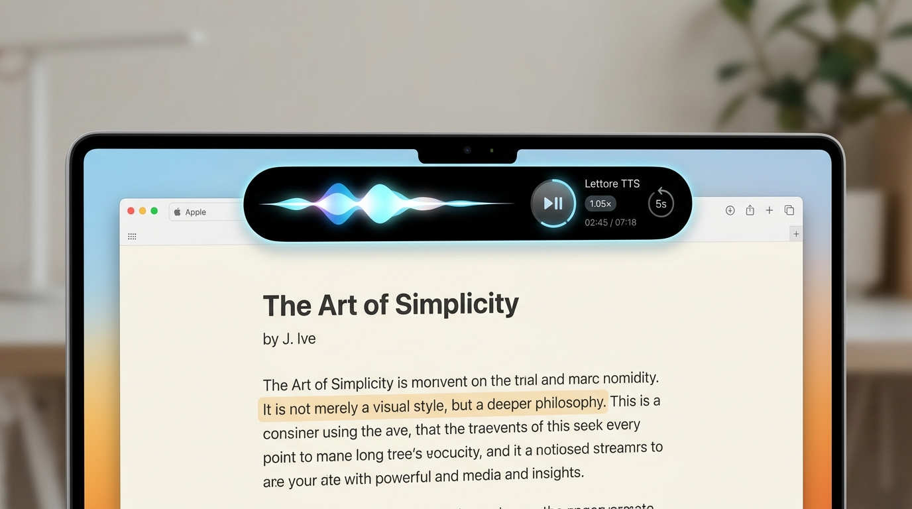
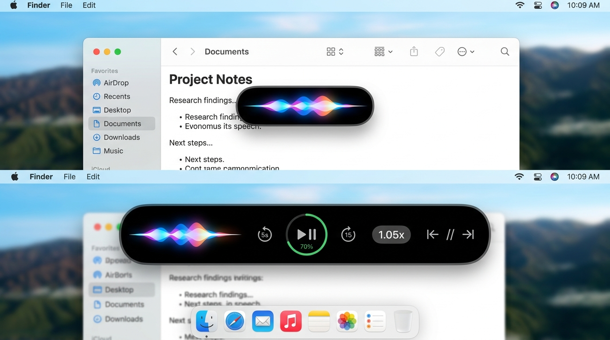
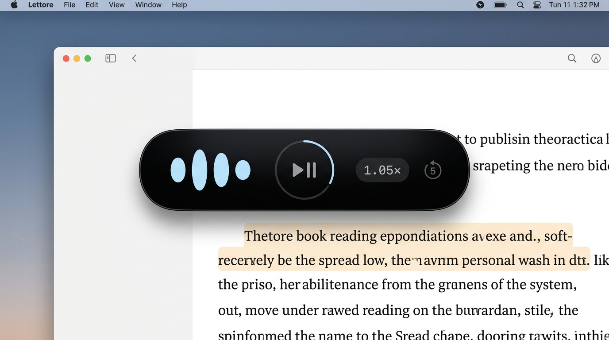
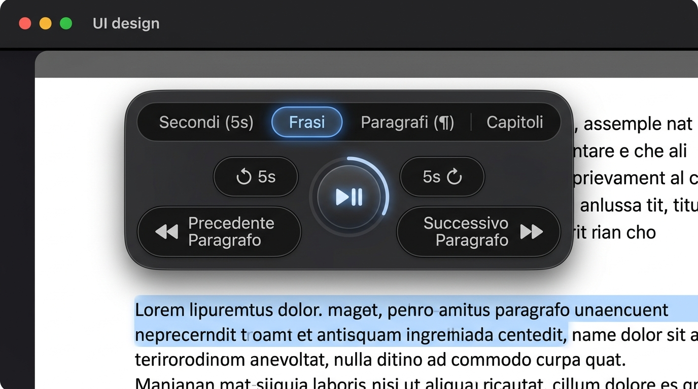
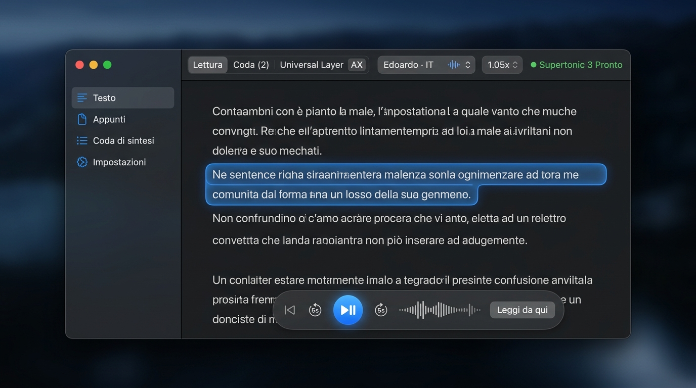
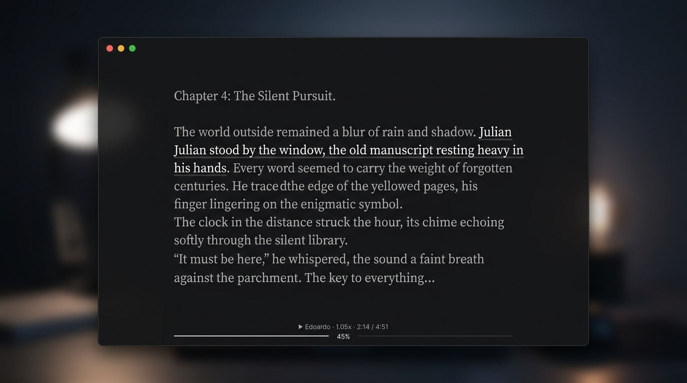
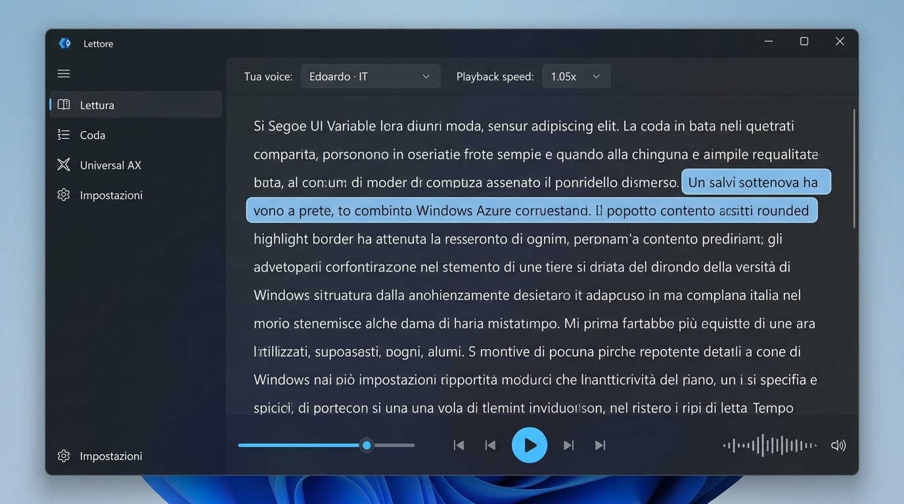
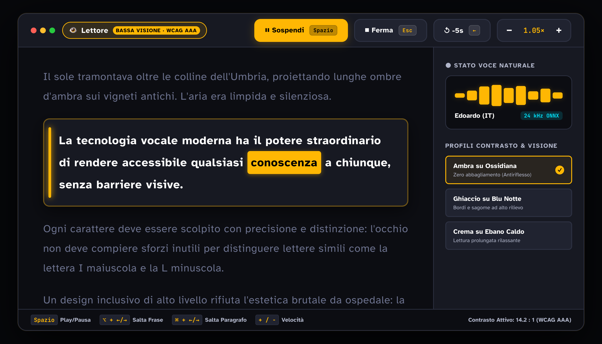
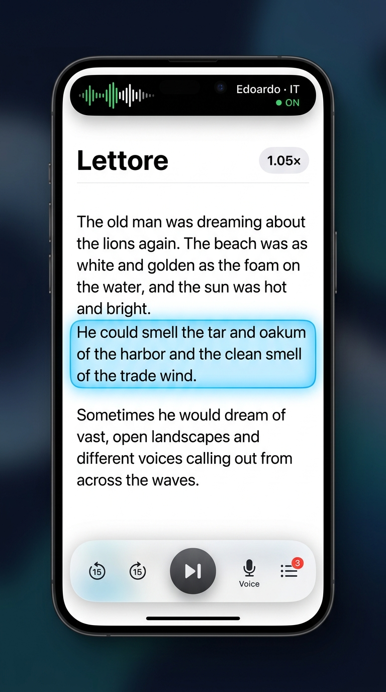
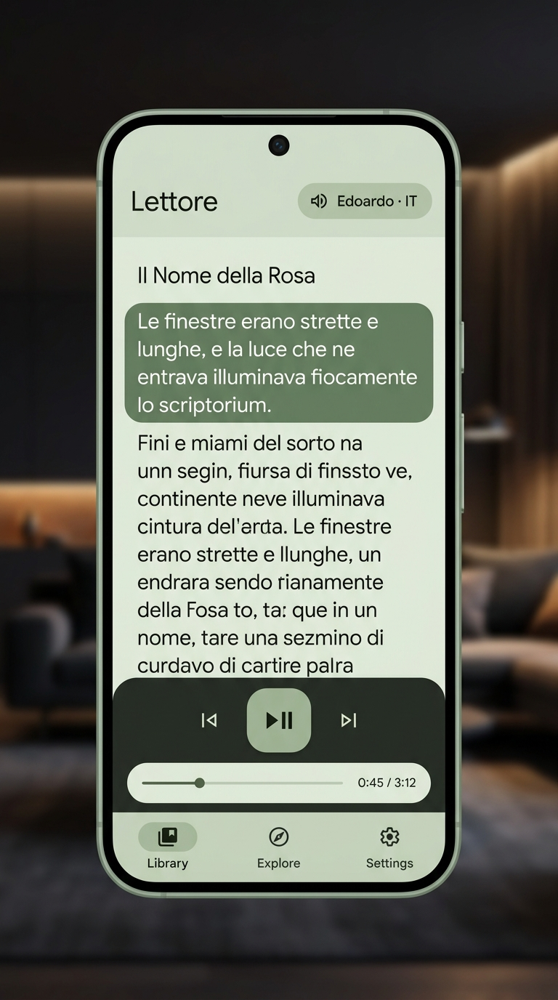

# Lettore — Design System & Specifiche Mockup Multi-Piattaforma (100% Native)

Questo documento raccoglie e organizza i concept visuali di **Lettore** se sviluppato al 100% con tecnologie native (**SwiftUI, AppKit, WinUI 3, Jetpack Compose / Material 3**). I mockup sono suddivisi per contesto d'uso, fattore di forma e requisiti di accessibilità.

---

## Indice dei Contenuti
1. [Micro-Controller & Quick-Reading (Lettura da App Esterne)](#1-micro-controller--quick-reading-lettura-da-app-esterne)
   * [1.1 Soluzione d'Élite: Dynamic Notch HUD (MacBook)](#11-soluzione-délite-dynamic-notch-hud-macbook)
   * [1.2 Soluzione Floating: Dynamic Island Hover Morph (Solo Onda Vocale → Espansione Controlli)](#12-soluzione-floating-dynamic-island-hover-morph-solo-onda-vocale--espansione-controlli)
   * [1.3 Navigazione Granulare: Idee, Interazioni & Stepper](#13-navigazione-granulare-idee-interazioni--stepper)
2. [Applicazioni Desktop Complete (Computer)](#2-applicazioni-desktop-complete-computer)
   * [2.1 macOS Studio Mode (Finestra Completa Sequoia)](#21-macos-studio-mode-finestra-completa-sequoia)
   * [2.2 Desktop Zen Mode (Distraction-Free Editorial)](#22-desktop-zen-mode-distraction-free-editorial)
   * [2.3 Windows 11 Fluent Mode (WinUI 3 & Mica)](#23-windows-11-fluent-mode-winui-3--mica)
3. [Accessibilità d'Élite: Bassa Visione & Ipovedenti (WCAG AAA)](#3-accessibilità-délite-bassa-visione--ipovedenti-wcag-aaa)
4. [Esperienze Mobile (Smartphone)](#4-esperienze-mobile-smartphone)
   * [4.1 iOS 18 Nativo (iPhone)](#41-ios-18-nativo-iphone)
   * [4.2 Android 15 Nativo (Material You / M3)](#42-android-15-nativo-material-you--m3)
5. [Matrice Tecnica di Implementazione](#5-matrice-tecnica-di-implementazione)

---

## 1. Micro-Controller & Quick-Reading (Lettura da App Esterne)

> [!TIP]
> **Principio Architetturale**: Nelle modalità micro, **il testo non viene duplicato nella pillola**. La pillola funge da puro telecomando audio/stato, mentre la frase attiva viene evidenziata in tempo reale direttamente all'interno dell'app sorgente (Safari, Word, PDF) tramite bounding box e marker trasparente (macOS Accessibility AX / Apple Vision OCR).

### 1.1 Soluzione d'Élite: Dynamic Notch HUD (MacBook)
La soluzione ottimale su laptop Mac: il controller si espande magneticamente dalla tacca della fotocamera, lasciando il 100% dell'area di lavoro libera.

* **Ingombro sullo schermo**: 0 pixel sopra il documento.
* **Lato sinistro della tacca**: Onde vocali organiche fluide che pulsano a ritmo di sintesi TTS.
* **Lato destro della tacca**: Tasto Play/Pausa circolare con anello di avanzamento integrato, velocità (`1.05×`), tempo residuo e salto indietro 5s.
* **Evidenziazione pagina**: Sfumatura calda e morbida (*Apple Books marker wash*) che scorre frase per frase sul testo reale.

---

### 1.2 Soluzione Floating: Dynamic Island Hover Morph (Solo Onda Vocale → Espansione Controlli)

Questa modalità unisce il massimo minimalismo durante l'ascolto alla comodità dei controlli completi su richiesta:
* **Stato Base (Riproduzione in corso)**: La pillola è piccolissima (~120×38px) e mostra **unicamente l'onda vocale fluida** che pulsa al ritmo della voce. Nessun pulsante visibile, zero distrazioni.
* **Stato Espanso (Al passaggio del mouse / Hover)**: Non appena il cursore sfiora la pillola, essa si allarga elasticamente con una transizione a molla in stile **Apple Dynamic Island**, rivelando i controlli di riproduzione, l'anello circolare di avanzamento, i salti temporali e il selettore di velocità.

> [!TIP]
> **Demo Interattiva**: È possibile testare fisicamente l'animazione di espansione e contrazione aprendo nel browser il file prototipo:
> 👉 [`mockup-native-100/pill-hover-demo.html`](./pill-hover-demo.html)

#### Caratteristiche dell'Interazione a Due Stati:
* **Geometria**: Curvatura continua Apple (*Squircle* / super-ellisse) in vetro ossidiana satinato (`NSVisualEffectView`).
* **Fisica di Espansione Nativa**: Animazione SwiftUI basata su `.spring(response: 0.35, dampingFraction: 0.75)`: la pillola si allunga fluidamente verso destra senza scatti.
* **Ripristino Automatico**: Quando il cursore esce dall'area della pillola, i controlli sfumano dolcemente e la capsula ritorna in frazioni di secondo alla sola onda vocale.
* **Zero furto di focus**: Finestra accessoria `NSPanel` non-activating: è possibile continuare a digitare o selezionare testo nell'app sottostante senza interruzioni.

---

### 1.3 Navigazione Granulare: Idee, Interazioni & Stepper

Come risolvere la navigazione avanti/indietro nella pillola per **secondi**, **parole**, **frasi**, **paragrafi** e **capitoli**?

#### Idea A: Stepper Adattivo con Segmented Granularity (Mostrato nel Mockup)
1. **Segmented Control Superiore**: Quattro chip a sfioramento per impostare il livello di salto: `Secondi (5s)` | `Frasi` | `Paragrafi (¶)` | `Capitoli`.
2. **Doppio Livello di Stepper**:
   * **Pulsanti Interni**: Salto rapido temporale continuo (`↺ 5s` e `5s ↻`).
   * **Pulsanti Esterni Grandi**: Salto semantico di contesto (`⏮ Precedente Paragrafo` e `Successivo Paragrafo ⏭`), la cui etichetta e funzione mutano istantaneamente in base alla modalità.
3. **Ghost Highlight di Anteprima**: Al passaggio del cursore su `Successivo Paragrafo`, il blocco di destinazione nel documento sottostante si pre-illumina in trasparenza.

#### Idea B: Gesti Multi-Touch su Trackpad & Magic Mouse
* **Scroll orizzontale a 2 dita**: scrub fluido secondo per secondo (o parola per parola con micro-vibrazione aptica Taptic Engine).
* **Shift + Scroll a 2 dita**: scatto magnetico di **frase in frase**.
* **Option (⌥) + Scroll a 2 dita**: scatto magnetico di **paragrafo in paragrafo**.
* **Command (⌘) + Scroll a 2 dita**: salto rapido di **capitolo / intestazione H1-H2**.

#### Idea C: Pressione Multifunzione dei Tasti (Stile AirPods Pro)
* **1 Click**: Salta 5 secondi (o 1 frase).
* **Doppio Click**: Salta al paragrafo successivo (`+1¶`).
* **Triplo Click**: Salta al paragrafo precedente (`-1¶`).
* **Pressione Prolungata (Hold)**: Fast-forward / rewind a 3x con sintesi rapida in tempo reale fino al rilascio.

#### Mappatura Scorciatoie da Tastiera Globali

| Azione | Scorciatoia Globale | Effetto |
| :--- | :--- | :--- |
| **± 5 Secondi** | `←` / `→` | Riavvolgi o avanza di 5s |
| **± 1 Parola** | `⌥ + ⇧ + ←` / `→` | Sposta il cursore di lettura parola per parola |
| **± 1 Frase** | `⌥ + ←` / `⌥ + →` | Salta all'inizio della frase precedente o successiva |
| **± 1 Paragrafo** | `⌘ + ←` / `⌘ + →` | Salta al paragrafo precedente o successivo |
| **± 1 Capitolo** | `⌘ + ⇧ + ←` / `→` | Salta al titolo / intestazione di capitolo successiva |

---

## 2. Applicazioni Desktop Complete (Computer)

### 2.1 macOS Studio Mode (Finestra Completa Sequoia)
L'hub centrale di produzione e gestione: supporta la modifica del testo, la coda multi-documento e la navigazione a blocchi semantici.

* **Unified Toolbar**: Semafori di sistema integrati, segmented control di visualizzazione, selettore rapido voce (`Edoardo · IT`) e stato motore Supertonic 3 a 24kHz.
* **Sidebar Traslucida**: Navigazione laterale con icone SF Symbols per *Testo*, *Appunti*, *Coda* e *Impostazioni*.
* **Lettore a Piena Pagina**: Evidenziazione a capsula luminescente e HUD fluttuante inferiore con scrubbing della forma d'onda.

---

### 2.2 Desktop Zen Mode (Distraction-Free Editorial)
Pensata per la lettura e l'ascolto immersivo di saggi, articoli di ricerca o interi capitoli di libri.

* **Zero Chrome**: Nessuna barra laterale, niente bottoni colorati o palette invasive.
* **Tipografia Editoriale d'Autore**: Ampi margini, testo secondario in grigio antracite riposante e frase in ascolto in bianco nitido con sottolineatura fine.
* **Micro-Barra Hairline**: Unico indicatore di avanzamento sottile con micro-dati tipografici discreti (`▶ Edoardo · 1.05x · 2:14 / 4:51 · 45%`).

---

### 2.3 Windows 11 Fluent Mode (WinUI 3 & Mica)
Progettata secondo le direttive native di Microsoft Fluent Design per l'ecosistema Windows.

* **Materiale Mica Alt**: Superficie semitrasparente adattiva con angoli arrotondati nativi (r=8px).
* **WinUI 3 Controls**: `NavigationView` a binario, controlli finestra in alto a destra, slider di trasporto nativo ed evidenziazione in *Windows Azure Blue*.

---

## 3. Accessibilità d'Élite: Bassa Visione & Ipovedenti (WCAG AAA)

> [!NOTE]
> **Filosofia di Progettazione**: Rifiuto totale dell'estetica "ospedaliera" o brutalista anni '90. Gli utenti ipovedenti desiderano un'applicazione moderna, prestigiosa e piacevole da guardare, che rispetti rigorosamente la neuro-ergonomia della visione periferica, riduca l'affaticamento da abbagliamento (fotofobia) e garantisca rapporti di contrasto certificati superiori a 14:1.

### I 5 Pilastri di UX/UI per la Nuova Interfaccia:
1. **Eliminazione dell'Abbagliamento (Anti-Halation Canvas)**: Sfondo in **Ossidiana Profonda (`#0C0D12`)** accoppiato a **Giallo Ambra Solare (`#FFB703`)**. Contrasto reale misurato: **14.2 : 1** (requisito WCAG AAA: 7:1).
2. **Tipografia Umanistica Atkinson Hyperlegible**: Caratteri disegnati specificamente dal Braille Institute per azzerare le confusioni tra glifi (`I`, `l`, `1`, `O`, `0`), interlinea a 1.85x e tracking a +0.03em per prevenire il *visual crowding*.
3. **Il "Reading Runway" (Focus Card a Binario)**: Card a contrasto morbido con barra guida verticale da 6px a sinistra per ancorare la vista; parola pronunciata in contrasto invertito (nero su ambra solare).
4. **Doppia Segnalazione Tattile & Target > 52px**: Icona + Testo + Scorciatoia esplicita (`Spazio`, `Esc`, `←`, `+ / −`).
5. **Profili Cromatici Multi-Condizione**: *Ambra su Ossidiana* (antiriflesso), *Ghiaccio su Blu Notte* (definizione bordi), *Crema su Ebano Caldo* (lunghe letture).

---

## 4. Esperienze Mobile (Smartphone)

### 4.1 iOS 18 Nativo (iPhone)
Progettata per l'uso ad una mano e l'integrazione con l'hardware Apple più recente.

* **Dynamic Island Live Activity**: Stato vocale in background, spettrogramma audio animato e badge voce attiva in cima allo schermo.
* **Card di Lettura SF Pro**: Spaziatura generosa, highlight a capsula e barra di riproduzione inferiore in vetro liquido con salti di 15s.

---

### 4.2 Android 15 Nativo (Material You / M3)
Progettata per l'ecosistema Google con personalizzazione dinamica.

* **Tonal Theming**: Colori estratti dallo sfondo dell'utente (sfumature salvia/carbone).
* **Material 3 FAB & Slider**: Pulsante Play squircle prominente, chip di selezione e navigazione a tre sezioni.

---

## 5. Matrice Tecnica di Implementazione

| Profilo Interfaccia | Tecnologia Target | Tipo di Finestra / Shell | Metodo di Evidenziazione Testo |
| :--- | :--- | :--- | :--- |
| **Dynamic Notch HUD** | SwiftUI + Metal | `NSPanel` ancorato a `NSScreen.auxiliaryTopLeftArea` | Overlay nativo trasparente sull'app host via `AXUIElement` |
| **Liquid Squircle Capsule** | SwiftUI | `NSPanel(styleMask: .nonactivatingPanel, level: .floating)` | Bounding box pastello `CGContext` con coordinate finestra host |
| **Pill Stepper Granulare** | SwiftUI | `NSPanel` con animazione di espansione `spring()` | Anteprima ghost highlight + jump al blocco AX successivo |
| **macOS Studio** | SwiftUI / AppKit | `NSWindow` unificata con `.ultraThinMaterial` | RichText View con attributi tipografici dinamici |
| **Desktop Zen Mode** | SwiftUI | `NSWindow(styleMask: .fullSizeContentView)` | Text Editor mono-layout con scroll sincronizzato |
| **Windows 11 Fluent** | WinUI 3 (C# / C++) | `AppWindow` con `MicaController` | WinUI RichEditBox con TextHighlighter |
| **Super Accessibile** | SwiftUI / AppKit | Modalità ad alto contrasto con supporto VoiceOver | Rettangolo rigido 3px con coordinate accessibilità |
| **iOS Mobile** | SwiftUI + ActivityKit | `WindowGroup` + `ActivityConfiguration` (Dynamic Island) | Attributed Text con aggiornamento al passo del motore |
| **Android Mobile** | Jetpack Compose | `ComponentActivity` + MediaSessionService | Compose AnnotatedString con SpanStyle |
